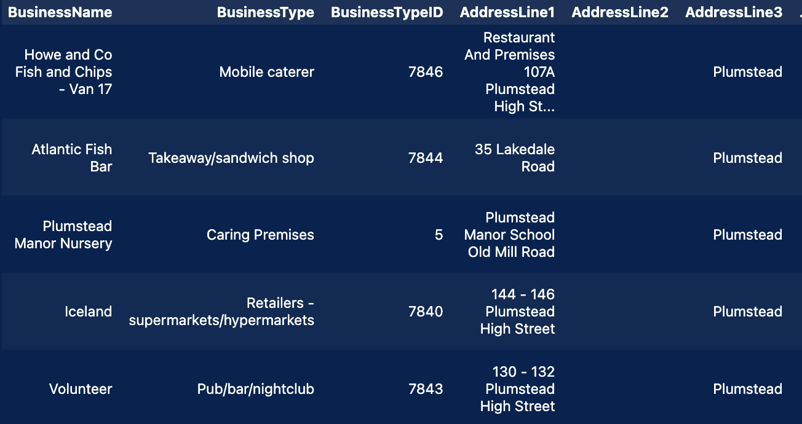

# Module 12 Challenge: noSQL Eat Safe, Love

This project is an introduction to noSQL databases, specifically mongodb. The data looks at food establishments in the UK. 

## Files

- Run in order:
1 NoSQL_setup.ipynb
1 NoSQL_analysis.ipynb

- Resources Folder:
1. establishments.json file used to populate the database
1. image.png is a screenshot used to document analysis results

## Author

Andrew Lane, 2024
- [@andrewplane](https://github.com/andrewplane)

## Analysis

- Number of establishments with a hygiene score of 20 (0 is best, higher numbers are worse): 41
- Number of establishments with London as the Local Authority and a RatingValue greater than or equal to 4: 33
- The top 5 establishments close to Penang Flavours with best Hygiene score:

## Setup

- Initialize mongodb, create database 'uk-food', and load the JSON data into collection 'establishments'
- Add the restaurant Penang Flavours to the database
- The BusinessTypeID for Restaurant/Cafe/Canteen is: 1
- The BusinessTypeID for Penang Flavours has been updated to 1
- All establishments in Dover have been removed from the database
- All latitude and longitudinal coordinates have been changed from strings to decimals
- All RatingValue entries have been changed to an integer unless they contain a text note.

## Acknowledgements

 - This project was created as part of the EdX Data Analytics Bootcamp
 - File structure and data is provided by EdX
 - The language model AI Xpert was used for troubleshooting during the project
